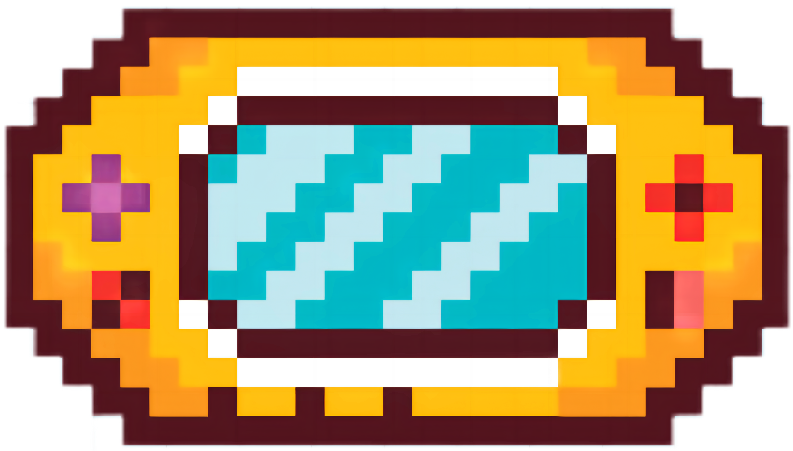
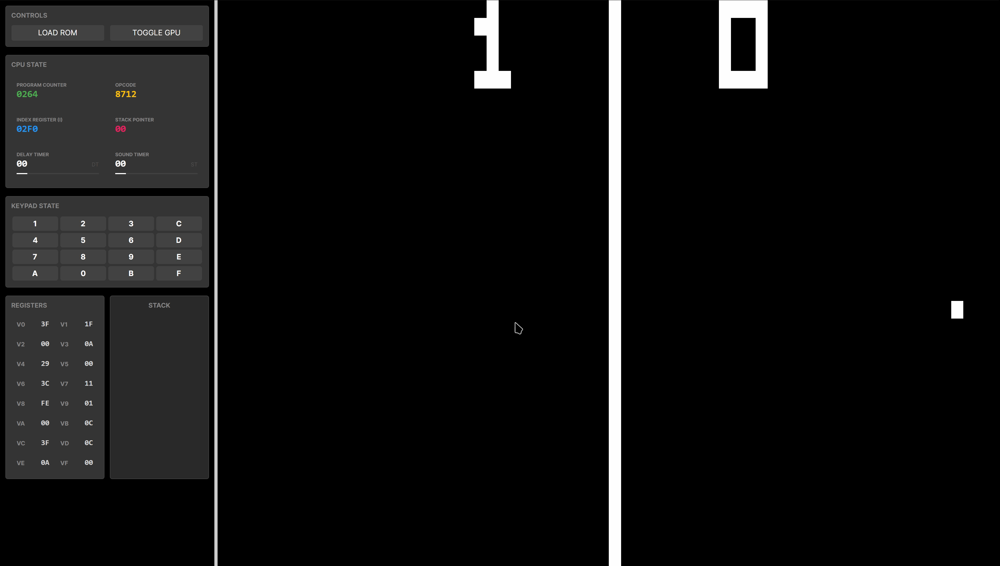
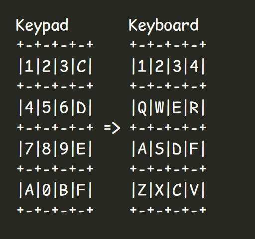

<a id="readme-top"></a>

<!-- PROJECT SHIELDS -->
<!--
*** I'm using Markdown "reference style" links for readability.
*** Reference links are enclosed in brackets [ ] instead of parentheses ( ).
*** See the bottom of this document for the declaration of the reference variables
*** for contributors-url, forks-url, etc. This is an optional, concise syntax you may use.
-->
[![Contributors][contributors-shield]][contributors-url]
[![Forks][forks-shield]][forks-url]
[![Stargazers][stars-shield]][stars-url]
[![Issues][issues-shield]][issues-url]
[![MIT License][license-shield]][license-url]

<!-- PROJECT LOGO -->
<br />
<div align="center">
  <a href="https://github.com/Mano-Liaoyan/Chip8Emulator">
    
  </a>

<h3 align="center">Chip8Emulator</h3>

  <p align="center">
    <!-- <a href="https://github.com/Mano-Liaoyan/Chip8Emulator">View Demo</a>
    · -->
    <a href="https://github.com/Mano-Liaoyan/Chip8Emulator/issues/new?labels=bug&template=bug-report---.md">Report Bug</a>
    ·
    <a href="https://github.com/Mano-Liaoyan/Chip8Emulator/issues/new?labels=enhancement&template=feature-request---.md">Request Feature</a>
  </p>
</div>

<!-- ABOUT THE PROJECT -->

## About The Project

**Chip8Emulator** is a high-performance, cross-platform Chip-8 interpreter built with **.NET 10**, **OpenTK** and **Avalonia UI**. It features smooth **OpenGL** hardware-accelerated rendering (Thanks
to [OpenTKAvalonia](https://github.com/SamboyCoding/OpenTKAvalonia)) and a modern dashboard-style interface for
real-time CPU state visualization.



### Key Features

* **Hardware Accelerated Rendering**: Uses OpenTK for efficient OpenGL-based display.
* **Real-time Visualization**: Monitor PC, Opcode, Index register, Stack, and Timers in real-time.
* **Cross-Platform**: Runs on Windows, Linux, and macOS thanks to Avalonia UI.
* **Integrated ROMs**: Comes with several classic ROMs like Tetris, Pong, and Brix for immediate testing.

<p align="right">(<a href="#readme-top">back to top</a>)</p>

### Built With

* <a href="https://dotnet.microsoft.com/en-us/download/dotnet/8.0">
    
  </a>
* [![Avalonia UI][avaloniaui-logo]](https://docs.avaloniaui.net/)

<p align="right">(<a href="#readme-top">back to top</a>)</p>

<!-- GETTING STARTED -->

## Getting Started

To get a local copy up and running, follow these simple steps. You can also download the release from the [Releases](https://github.com/Mano-Liaoyan/Chip8Emulator/releases) page.

### Prerequisites

* [.NET 10 SDK](https://dotnet.microsoft.com/en-us/download/dotnet/10.0)

### Installation & Build

1. Clone the repo

   ```sh
   git clone https://github.com/Mano-Liaoyan/Chip8Emulator.git
   ```

2. Navigate to the project directory

   ```sh
   cd Chip8Emulator/Chip8Emulator
   ```

3. Build and Run the project

   ```sh
   dotnet run
   ```

<p align="right">(<a href="#readme-top">back to top</a>)</p>

<!-- USAGE EXAMPLES -->

## Usage

1. **Load a ROM**: Click the "LOAD ROM" button to select a `.ch8` file.
2. **Toggle GPU**: Use the "TOGGLE GPU" button to turn on or off the screen.
3. **Monitor State**: Watch the left panel for live updates of the registers and stack.

### Controls (Keypad Mapping)

The Chip-8 used a 16-key hexadecimal keypad (0-F). This is mapped to the following QWERTY keys:



<p align="right">(<a href="#readme-top">back to top</a>)</p>

<!-- ROADMAP -->
<!-- ## Roadmap

- [ ] Feature 1
- [ ] Feature 2
- [ ] Feature 3
    - [ ] Nested Feature

See the [open issues](https://github.com/Mano-Liaoyan/Chip8Emulator/issues) for a full list of proposed features (and known issues).

<p align="right">(<a href="#readme-top">back to top</a>)</p> -->

### Top contributors

<a href="https://github.com/Mano-Liaoyan/Chip8Emulator/graphs/contributors">
  
</a>

<!-- LICENSE -->

## License

Distributed under the MIT License. See `LICENSE.txt` for more information.

<p align="right">(<a href="#readme-top">back to top</a>)</p>

<!-- ACKNOWLEDGMENTS -->

## Acknowledgments

* [Queso Fuego's Chip8 tutorial](https://www.youtube.com/watch?v=YvZ3LGaNiS0&list=PLT7NbkyNWaqbyBMzdySdqjnfUFxt8rnU_)
* [Austin Morlan's Building a CHIP-8 Emulator [C++]](https://austinmorlan.com/posts/chip8_emulator/)

<!-- * []()
* []() -->

<p align="right">(<a href="#readme-top">back to top</a>)</p>

<!-- MARKDOWN LINKS & IMAGES -->
<!-- https://www.markdownguide.org/basic-syntax/#reference-style-links -->

[contributors-shield]: https://img.shields.io/github/contributors/Mano-Liaoyan/Chip8Emulator.svg?style=for-the-badge

[contributors-url]: https://github.com/Mano-Liaoyan/Chip8Emulator/graphs/contributors

[forks-shield]: https://img.shields.io/github/forks/Mano-Liaoyan/Chip8Emulator.svg?style=for-the-badge

[forks-url]: https://github.com/Mano-Liaoyan/Chip8Emulator/network/members

[stars-shield]: https://img.shields.io/github/stars/Mano-Liaoyan/Chip8Emulator.svg?style=for-the-badge

[stars-url]: https://github.com/Mano-Liaoyan/Chip8Emulator/stargazers

[issues-shield]: https://img.shields.io/github/issues/Mano-Liaoyan/Chip8Emulator.svg?style=for-the-badge

[issues-url]: https://github.com/Mano-Liaoyan/Chip8Emulator/issues

[license-shield]: https://img.shields.io/github/license/Mano-Liaoyan/Chip8Emulator.svg?style=for-the-badge

[license-url]: https://github.com/Mano-Liaoyan/Chip8Emulator/blob/master/License.txt

[product-screenshot]: ../docs/demonstration.gif

[avaloniaui-logo]: https://avatars.githubusercontent.com/u/14075148?s=48
